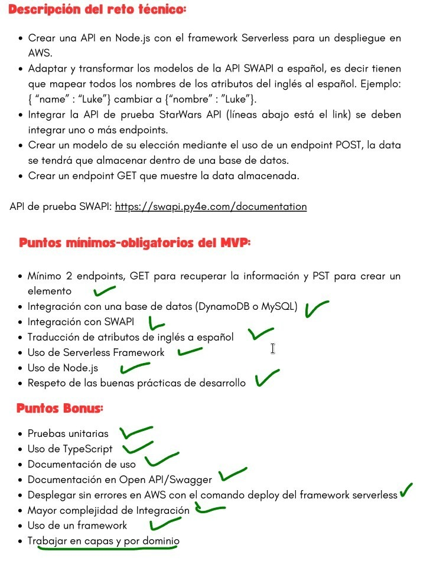

# Documentacion

Este proyecto está desplegado en AWS con serverless framework y tiene como url base el siguiente:
<br />
https://r3g2bsk9l6.execute-api.us-east-2.amazonaws.com/dev

## Inicio

Pre requisitos:

- git
- serverless cli v3
- configurar sus credenciales de AWS a serverless con ` serverless config credentials ...`
- Java (JDK), debido a que se está usando dynamodb localmente con "serverless-dynamodb".

Instalación:

- Ejecutar `npm install`
- Añadir el archivo `.env` similar al archivo `.env.example`

Inicializar:
- `npm run install:dynamodb`

Pruebas:

- `npm run test`

Desarrollo:

- `npm run dev` o `sls offline start`

Despliegue:

- `npm run sls:deploy` o `sls deploy`

## Como funciona

Hay 10 endpoints:

- 2 que sirve como Proxy de SWAPI pero que traduce todos los campos del inglés al español (1 lambda). Aquí he usado el servicio de Amazon Translate (como no tiene soporte de ARN la política generada atachada al lambda para consumir este servicio tiene permisos a todos los recursos "\*" <única forma>)
- 5 para el CRUD de personas con un modelo igual que el de Personas de SWAPI (https://swapi.py4e.com/api/people/schema) (5 lambdas, 1 dynamodb)
- 3 generados para la documentación en Swagger

### API Translate

#### Definición de API Translate

- Listar recursos:

  GET `/dev/translate/{recurso de SWAPI}`

  (`/dev/translate/people`)

  Ejemplo: https://r3g2bsk9l6.execute-api.us-east-2.amazonaws.com/dev/translate/people

- Listar 1 recurso:

  GET `/dev/translate/{recurso de SWAPI}/{id del recurso}`

  (`/dev/translate/people/1`)

  Ejemplo:
  <br />
  https://r3g2bsk9l6.execute-api.us-east-2.amazonaws.com/dev/translate/people/1

### API Persona

#### Esquemas de Api Persona

- RespuestaGenérica`<T>`

  ```json
  {
    "data": "<T>",
    "error": "<any | null>"
  }
  ```

- Persona

  ```json
  {
    "personId": "<string>",
    "name": "<string>",
    "height": "<string>",
    "mass": "<string>",
    "hair_color": "<string>",
    "skin_color": "<string>",
    "eye_color": "<string>",
    "birth_year": "<string>",
    "gender": "<string>",

    "homeworld": "https://swapi.py4e.com/api/planets/1/",
    "films": [],
    "species": [],
    "vehicles": [],
    "starships": [],
    "url": "",
    "created": "",
    "edited": ""
  }
  ```

- CrearPersona

  ```json
  {
    "name": "<string>",
    "height": "<string>",
    "mass": "<string>",
    "hair_color": "<string>",
    "skin_color": "<string>",
    "eye_color": "<string>",
    "birth_year": "<string>",
    "gender": "<string>"
  }
  ```

- ActualizarPersona
  ```json
  {
    "personId": "<string>",
    "name": "<string>",
    "height": "<string>",
    "mass": "<string>",
    "hair_color": "<string>",
    "skin_color": "<string>",
    "eye_color": "<string>",
    "birth_year": "<string>",
    "gender": "<string>"
  }
  ```

#### Definición de API Translate

- Listar personas:

  GET `/dev/person`
  <br />
  RESPONSE `RespuestaGenerica<Persona[]>`

  Ejemplo:
  <br />
  GET https://r3g2bsk9l6.execute-api.us-east-2.amazonaws.com/dev/person

- Obtener una persona por su Id:

  GET `/dev/person/{id}`
  <br />
  RESPONSE `RespuestaGenerica<Persona>`

  Ejemplo:
  <br />
  GET https://r3g2bsk9l6.execute-api.us-east-2.amazonaws.com/dev/person/89

- Crear una persona:

  POST `/dev/person`
  <br>
  BODY `CrearPersona`
  <br />
  RESPONSE `RespuestaGenerica<string(personId) | false>`
  <br />
  (T: si lo creó entonces devolverá el id de la persona, caso contrario devolverá falso )

  Ejemplo:
  <br />
  POST https://r3g2bsk9l6.execute-api.us-east-2.amazonaws.com/dev/person
  <br />
  BODY

  ```json
  {
    "name": "John Doe",
    "height": "172",
    "mass": "177",
    "hair_color": "blond",
    "skin_color": "fair",
    "eye_color": "blue",
    "birth_year": "19BBY",
    "gender": "male"
  }
  ```

- Actualizar una persona:

  PUT `/dev/person/{id}`
  <br>
  BODY `ActualizarPersona`
  <br />
  RESPONSE `RespuestaGenerica<boolean>`
  <br />
  (T: si no lo actualizó será falso, caso contrario será verdadero )

  Ejemplo:
  <br />
  PUT https://r3g2bsk9l6.execute-api.us-east-2.amazonaws.com/dev/person/89
  <br />
  BODY

  ```json
  {
    "personId": "89",
    "name": "John Doe",
    "height": "172",
    "mass": "177",
    "hair_color": "blond",
    "skin_color": "fair",
    "eye_color": "blue",
    "birth_year": "19BBY",
    "gender": "male"
  }
  ```

- Eliminar una persona:
  DELETE `/dev/person/{id}`
  <br />
  RESPONSE `RespuestaGenerica<boolean>`
  <br />
  (T: si no lo eliminó será falso, caso contrario será verdadero )

  Ejemplo:
  <br />
  DELETE https://r3g2bsk9l6.execute-api.us-east-2.amazonaws.com/dev/person/89


## Características adicionales

Se implemetó Swagger Documentation, Unit Test, AWS Translate, dynamodb local, lambda local entre otras cosas.
Este proyecto parece cumplir con todos los checks requeridos y opcionales, menos el último puntos bonus.
Se adjunta imagen (status.jpeg)




## Mensaje final

Parece una difícil decisión estructurar el proyecto con la arquitectura de capas y dominio. El motivo es que como es un proyecto pequeño (como cualquier lambda) es que no merecía tanto la pena dicha implementación. Sin embargo, se hizo un esfuerzo para mantener desacoplado el dominio de la infra.

PD: Disfruté mucho desarrollando la prueba técnica, espero que se note en este proyecto. ✨

Muchas gracias por la oportunidad 😃!

# Saludos Team Rímac! 😊
